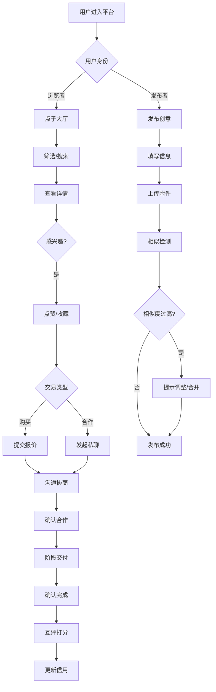

# 校园点子交易平台 - 产品需求文档 (PRD)

## 1. 产品概述

校园点子交易平台是一个面向大学生的创意撮合平台，帮助学生将课程项目、社团活动和小生意创意进行低成本对接。平台连接创意拥有者与寻找机会的同学，通过智能匹配、信用体系和协作工具，打造安全高效的校园创意生态。

**核心价值**：降低创意变现门槛，促进校园协作，建立可信的创意交易环境。

---

## 2. 核心功能

### 2.1 用户角色

| 角色 | 注册方式 | 核心权限 |
|------|----------|----------|
| 普通用户 | 学号/校园邮箱认证 | 浏览、发布、交易、评价 |
| 认证用户 | 完善个人信息+实名认证 | 解锁高级筛选、优先展示 |
| 管理员 | 后台分配 | 内容审核、举报处理、用户管理 |

### 2.2 功能模块

1. **点子大厅**：创意卡片瀑布流、多维度筛选、智能推荐
2. **悬赏需求**：发布需求、预算设置、截止日期、接单管理
3. **点子详情**：完整信息展示、附件预览、报价入口、相似推荐
4. **协作聊天室**：实时沟通、文件共享、阶段确认、交易记录
5. **信用主页**：用户画像、交易历史、评分展示、成就徽章

### 2.3 页面详情

| 页面名称 | 模块名称 | 功能描述 |
|----------|----------|----------|
| 点子大厅 | 创意卡片列表 | 瀑布流展示创意摘要，支持学院/领域/预算筛选 |
| 点子大厅 | 搜索栏 | 关键词搜索、热门标签、历史记录 |
| 点子大厅 | 筛选面板 | 学院、领域、预算范围、交易类型（出售/找队友） |
| 点子大厅 | 发布入口 | 快速发布创意按钮，引导填写表单 |
| 悬赏需求 | 需求列表 | 展示待接需求，显示预算、截止日期、发布者信用 |
| 悬赏需求 | 发布需求 | 表单填写：标题、描述、预算范围、截止日期、附件 |
| 悬赏需求 | 接单管理 | 查看接单申请、选择合作者、进度跟踪 |
| 点子详情 | 基本信息 | 标题、描述、预算、类型、发布者信息 |
| 点子详情 | 附件展示 | 草图、文档预览与下载 |
| 点子详情 | 互动区域 | 点赞、收藏、举报、相似点子提示 |
| 点子详情 | 报价入口 | 提交报价、留言说明、联系方式 |
| 协作聊天室 | 消息区域 | 实时文字聊天、表情、文件传输 |
| 协作聊天室 | 阶段交付 | 提交交付物、确认完成、阶段标记 |
| 协作聊天室 | 交易记录 | 资金流向、时间线、确认状态 |
| 信用主页 | 用户画像 | 头像、昵称、学院、认证状态、信用分 |
| 信用主页 | 交易统计 | 成交数量、成功率、平均评分 |
| 信用主页 | 评价列表 | 收到的评价详情、评分分布图 |
| 信用主页 | 成就展示 | 徽章墙、活跃度、贡献值 |
| 发布创意 | 基础信息 | 标题、描述、学院、领域标签 |
| 发布创意 | 交易设置 | 类型（出售/找队友）、预算范围、联系方式 |
| 发布创意 | 附件上传 | 支持图片、PDF、文档格式 |
| 发布创意 | 相似检测 | 提交前检测相似点子，提示合并或调整 |
| 个人中心 | 我的发布 | 管理已发布创意、编辑、下架 |
| 个人中心 | 我的收藏 | 收藏的创意列表 |
| 个人中心 | 交易记录 | 作为买方/卖方的所有交易 |
| 个人中心 | 消息通知 | 系统通知、私信提醒、报价通知 |

---

## 3. 核心流程

### 3.1 发布创意流程

用户点击发布 → 填写创意信息 → 上传附件 → 系统检测相似点子 → 显示相似提示 → 用户确认/调整 → 发布成功 → 进入点子大厅

### 3.2 交易撮合流程

浏览点子大厅 → 筛选/搜索 → 查看详情 → 点赞/收藏 → 发起私聊或提交报价 → 双方沟通 → 确认合作 → 阶段交付确认 → 交易完成 → 互评打分

### 3.3 流程图

---

## 4. 用户界面设计

### 4.1 设计风格

**主题定位**：年轻活力、专业可信、简洁高效

- **主色调**：活力橙 (#FF6B35) + 科技蓝 (#2D5BFF)
- **辅助色**：薄荷绿 (#10B981) 用于成功状态、珊瑚红 (#EF4444) 用于警告
- **背景色**：浅灰白 (#F8FAFC) 主背景、纯白 (#FFFFFF) 卡片背景
- **字体方案**：
  - 标题：思源黑体 / Noto Sans SC (Bold)
  - 正文：系统默认中文字体
  - 字号层级：32px 大标题、24px 标题、16px 正文、14px 辅助
- **按钮风格**：圆角(12px)、渐变背景、悬停微动效
- **卡片风格**：圆角(16px)、柔和阴影、悬停上浮效果
- **图标风格**：线性图标为主、品牌色点缀

### 4.2 页面设计概览

| 页面名称 | 模块名称 | UI元素 |
|----------|----------|--------|
| 点子大厅 | 顶部导航 | Logo、搜索框、发布按钮、用户头像、通知图标 |
| 点子大厅 | 筛选侧栏 | 学院多选、领域标签云、预算滑块、类型切换 |
| 点子大厅 | 创意卡片 | 封面图、标题、摘要、标签、价格区间、发布者头像、点赞数 |
| 点子详情 | 头部信息 | 大图展示、标题、类型标签、发布者信息卡片 |
| 点子详情 | 内容区 | 富文本描述、附件列表、相似点子推荐卡片 |
| 点子详情 | 操作栏 | 点赞按钮、收藏按钮、举报入口、报价按钮 |
| 协作聊天室 | 消息区 | 气泡消息、时间戳、已读状态、文件预览卡片 |
| 协作聊天室 | 侧边栏 | 交易阶段进度条、交付物列表、确认按钮 |
| 信用主页 | 头部卡片 | 大头像、昵称、学院、认证徽章、信用分仪表盘 |
| 信用主页 | 数据可视化 | 评分雷达图、交易趋势折线图、徽章墙网格 |
| 发布页面 | 表单区 | 分步表单、实时预览、相似提示浮层 |

### 4.3 响应式设计

- **桌面优先**：主要针对 1440px 宽度设计，充分利用屏幕空间
- **平板适配**：768px-1024px 侧栏折叠为抽屉，卡片双列布局
- **移动适配**：375px-768px 单列布局，底部固定操作栏，手势滑动切换

### 4.4 动效设计

- **页面过渡**：淡入淡出 + 轻微上移 (200ms)
- **卡片悬停**：上浮 4px + 阴影加深
- **按钮点击**：缩放 0.95 + 波纹效果
- **加载状态**：骨架屏 + 渐显动画
- **点赞动画**：心形弹跳 + 粒子效果
- **消息通知**：右侧滑入 + 3秒后淡出

---

## 5. 特色功能

### 5.1 相似点子智能检测

- 发布时自动比对已有创意
- 相似度 > 70% 时弹出提示
- 提供合并建议或描述调整引导
- 展示相似点子列表供参考

### 5.2 阶段交付确认

- 支持将交易拆分为多个阶段
- 每阶段可上传交付物
- 双方确认后进入下一阶段
- 进度条可视化展示

### 5.3 信用评分体系

- 多维度评分：响应速度、交付质量、沟通态度
- 历史交易加权平均
- 信用分影响搜索排序权重
- 低信用用户限制发布频率

### 5.4 举报与审核机制

- 一键举报抄袭内容
- 提交证据材料
- 管理员审核处理
- 违规用户降权或封禁