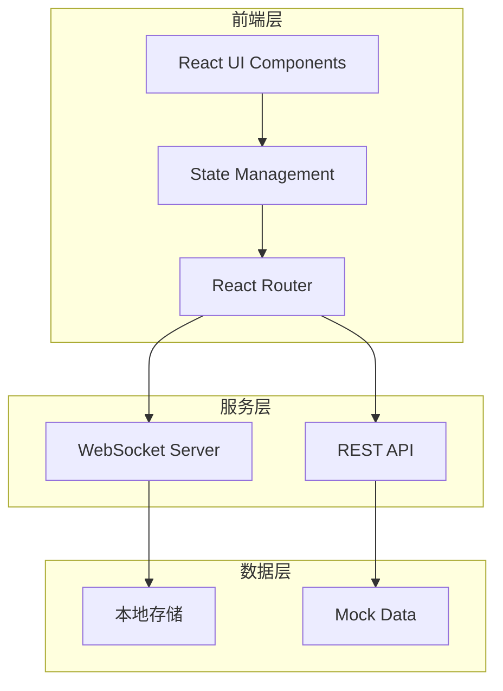
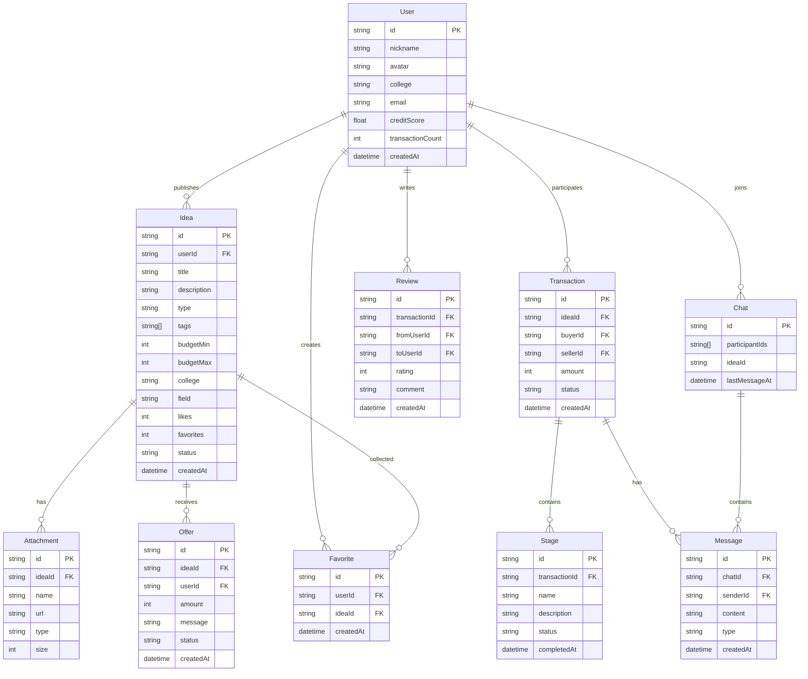

# 校园点子交易平台 - 技术架构文档

## 1. 架构设计



## 2. 技术说明

| 层级 | 技术选型 | 说明 |
|------|----------|------|
| 前端框架 | React 18 + TypeScript | 组件化开发，类型安全 |
| 样式方案 | Tailwind CSS 3 | 原子化 CSS，快速开发 |
| 构建工具 | Vite | 快速热更新，优化构建 |
| 状态管理 | Zustand | 轻量级状态管理 |
| 路由管理 | React Router 6 | 声明式路由 |
| 实时通信 | Socket.io Client | 聊天室实时消息 |
| 数据持久化 | LocalStorage + Mock | 本地模拟数据存储 |

## 3. 路由定义

| 路由路径 | 页面名称 | 功能描述 |
|----------|----------|----------|
| `/` | 点子大厅 | 首页，展示创意列表 |
| `/idea/:id` | 点子详情 | 查看单个创意详情 |
| `/post` | 发布创意 | 发布新创意表单 |
| `/bounty` | 悬赏需求 | 需求列表页面 |
| `/bounty/post` | 发布需求 | 发布新需求表单 |
| `/chat` | 消息列表 | 私聊会话列表 |
| `/chat/:id` | 协作聊天室 | 单个聊天会话 |
| `/user/:id` | 信用主页 | 用户个人主页 |
| `/profile` | 个人中心 | 当前用户设置 |
| `/my/ideas` | 我的发布 | 管理发布的创意 |
| `/my/favorites` | 我的收藏 | 收藏的创意列表 |
| `/my/transactions` | 交易记录 | 历史交易列表 |

## 4. 数据模型

### 4.1 实体关系图



### 4.2 类型定义

```typescript
interface User {
  id: string;
  nickname: string;
  avatar: string;
  college: string;
  email: string;
  creditScore: number;
  transactionCount: number;
  badges: Badge[];
  createdAt: string;
}

interface Idea {
  id: string;
  userId: string;
  title: string;
  description: string;
  type: 'sell' | 'collaborate';
  tags: string[];
  budgetMin: number;
  budgetMax: number;
  college: string;
  field: string;
  attachments: Attachment[];
  likes: number;
  favorites: number;
  status: 'active' | 'closed' | 'completed';
  createdAt: string;
  updatedAt: string;
}

interface Attachment {
  id: string;
  ideaId: string;
  name: string;
  url: string;
  type: 'image' | 'pdf' | 'document';
  size: number;
}

interface Offer {
  id: string;
  ideaId: string;
  userId: string;
  amount: number;
  message: string;
  status: 'pending' | 'accepted' | 'rejected';
  createdAt: string;
}

interface Transaction {
  id: string;
  ideaId: string;
  buyerId: string;
  sellerId: string;
  amount: number;
  stages: Stage[];
  status: 'pending' | 'in_progress' | 'completed' | 'cancelled';
  createdAt: string;
}

interface Stage {
  id: string;
  transactionId: string;
  name: string;
  description: string;
  deliverables: string[];
  status: 'pending' | 'submitted' | 'confirmed';
  submittedAt?: string;
  confirmedAt?: string;
}

interface Chat {
  id: string;
  participantIds: string[];
  ideaId?: string;
  messages: Message[];
  lastMessageAt: string;
}

interface Message {
  id: string;
  chatId: string;
  senderId: string;
  content: string;
  type: 'text' | 'file' | 'system';
  fileUrl?: string;
  read: boolean;
  createdAt: string;
}

interface Review {
  id: string;
  transactionId: string;
  fromUserId: string;
  toUserId: string;
  rating: number;
  dimensions: {
    response: number;
    quality: number;
    communication: number;
  };
  comment: string;
  createdAt: string;
}

interface Favorite {
  id: string;
  userId: string;
  ideaId: string;
  createdAt: string;
}

interface Badge {
  id: string;
  name: string;
  icon: string;
  description: string;
  earnedAt: string;
}
```

## 5. 状态管理设计

```typescript
interface AppState {
  user: User | null;
  ideas: Idea[];
  currentIdea: Idea | null;
  chats: Chat[];
  currentChat: Chat | null;
  transactions: Transaction[];
  favorites: string[];
  
  setUser: (user: User | null) => void;
  addIdea: (idea: Idea) => void;
  updateIdea: (id: string, data: Partial<Idea>) => void;
  likeIdea: (id: string) => void;
  favoriteIdea: (id: string) => void;
  sendMessage: (chatId: string, content: string) => void;
  submitOffer: (offer: Offer) => void;
  confirmStage: (transactionId: string, stageId: string) => void;
  submitReview: (review: Review) => void;
}
```

## 6. 组件架构

```
src/
├── components/
│   ├── common/
│   │   ├── Button.tsx
│   │   ├── Input.tsx
│   │   ├── Card.tsx
│   │   ├── Modal.tsx
│   │   ├── Badge.tsx
│   │   ├── Avatar.tsx
│   │   └── Tag.tsx
│   ├── layout/
│   │   ├── Header.tsx
│   │   ├── Sidebar.tsx
│   │   ├── Footer.tsx
│   │   └── Layout.tsx
│   ├── idea/
│   │   ├── IdeaCard.tsx
│   │   ├── IdeaList.tsx
│   │   ├── IdeaFilter.tsx
│   │   ├── IdeaDetail.tsx
│   │   └── IdeaForm.tsx
│   ├── chat/
│   │   ├── ChatList.tsx
│   │   ├── ChatRoom.tsx
│   │   ├── MessageBubble.tsx
│   │   └── StageProgress.tsx
│   ├── user/
│   │   ├── UserCard.tsx
│   │   ├── CreditScore.tsx
│   │   ├── ReviewList.tsx
│   │   └── BadgeWall.tsx
│   └── transaction/
│       ├── OfferForm.tsx
│       ├── StageCard.tsx
│       └── TransactionTimeline.tsx
├── pages/
│   ├── Home.tsx
│   ├── IdeaDetail.tsx
│   ├── PostIdea.tsx
│   ├── Bounty.tsx
│   ├── Chat.tsx
│   ├── ChatRoom.tsx
│   ├── Profile.tsx
│   ├── UserPage.tsx
│   ├── MyIdeas.tsx
│   ├── Favorites.tsx
│   └── Transactions.tsx
├── store/
│   ├── userStore.ts
│   ├── ideaStore.ts
│   ├── chatStore.ts
│   └── transactionStore.ts
├── hooks/
│   ├── useIdeas.ts
│   ├── useChat.ts
│   └── useTransactions.ts
├── utils/
│   ├── api.ts
│   ├── storage.ts
│   └── helpers.ts
├── data/
│   └── mockData.ts
├── types/
│   └── index.ts
├── App.tsx
├── main.tsx
└── index.css
```

## 7. 关键功能实现

### 7.1 相似点子检测算法

```typescript
function calculateSimilarity(idea1: Idea, idea2: Idea): number {
  const titleSimilarity = jaccardSimilarity(
    idea1.title.split(''),
    idea2.title.split('')
  );
  
  const tagSimilarity = jaccardSimilarity(
    new Set(idea1.tags),
    new Set(idea2.tags)
  );
  
  const fieldMatch = idea1.field === idea2.field ? 1 : 0;
  const collegeMatch = idea1.college === idea2.college ? 0.5 : 0;
  
  return titleSimilarity * 0.4 + tagSimilarity * 0.3 + 
         fieldMatch * 0.2 + collegeMatch * 0.1;
}

function findSimilarIdeas(newIdea: Idea, existingIdeas: Idea[]): Idea[] {
  return existingIdeas
    .map(idea => ({ idea, similarity: calculateSimilarity(newIdea, idea) }))
    .filter(item => item.similarity > 0.7)
    .sort((a, b) => b.similarity - a.similarity)
    .slice(0, 5)
    .map(item => item.idea);
}
```

### 7.2 信用评分计算

```typescript
function calculateCreditScore(user: User, reviews: Review[]): number {
  if (reviews.length === 0) return 60;
  
  const avgRating = reviews.reduce((sum, r) => sum + r.rating, 0) / reviews.length;
  const avgResponse = reviews.reduce((sum, r) => sum + r.dimensions.response, 0) / reviews.length;
  const avgQuality = reviews.reduce((sum, r) => sum + r.dimensions.quality, 0) / reviews.length;
  const avgCommunication = reviews.reduce((sum, r) => sum + r.dimensions.communication, 0) / reviews.length;
  
  const baseScore = avgRating * 10;
  const transactionBonus = Math.min(user.transactionCount * 2, 20);
  const consistencyBonus = calculateConsistency(reviews) * 5;
  
  return Math.min(100, baseScore + transactionBonus + consistencyBonus);
}
```

## 8. 性能优化策略

- **虚拟列表**：创意列表使用虚拟滚动，仅渲染可视区域
- **图片懒加载**：附件图片按需加载
- **防抖节流**：搜索输入、筛选操作防抖处理
- **本地缓存**：用户信息、收藏列表缓存到 LocalStorage
- **代码分割**：路由级别懒加载，减少首屏体积